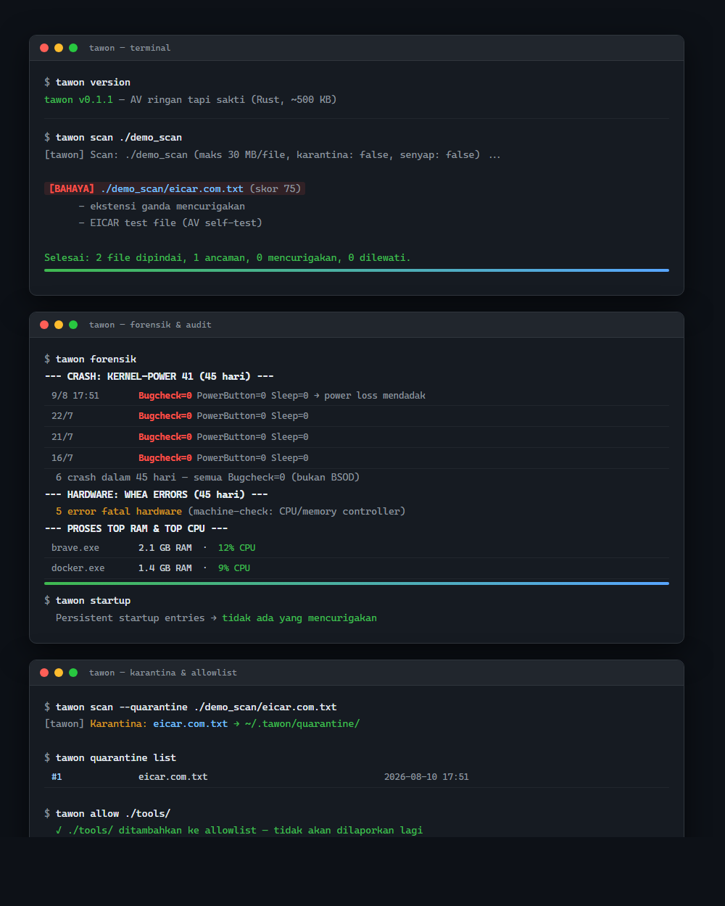

# 🐝 Tawon — ANTI VIRUS ringan tapi sakti

> *"Diam, tapi menyengat."*


<!-- Setelah repo di-push ke GitHub, ganti badge CI & License dengan versi dinamis (ganti <user>):


-->




*Scan sungguhan: file uji EICAR terdeteksi (`[BAHAYA]`), forensik sistem, dan karantina.*

Antivirus pribadi berbasis **Rust**: satu biner ~500 KB, tanpa ketergantungan
runtime, memory-safe, minim resource — nyaman dijalankan bahkan di PC berusia
15 tahun.

**Filosofi: *diam kalau tidak yakin*.** Tidak berisik, tidak salah tangkap
software yang tidak berbahaya:
- **BAHAYA** hanya untuk: hash cocok (pasti) atau signature kritis / skor ≥ 70 (sangat yakin)
- **CURIGA** = heuristik ringan → hanya informasi, **tidak pernah dihapus/karantina otomatis**
- **Allowlist** → file/folder tepercaya tidak pernah dilaporkan lagi

## ✨ Fitur

| Fitur | Deskripsi |
|---|---|
| 🔬 **Scan signature bertingkat** | `HASH` (pasti) · `HEX` (tinggi, wildcard `??`) · `TEXT!` (kritis) · `TEXT` (medium) |
| 🧠 **Heuristik** | Parse PE asli (32 & **64-bit**) → API injeksi (`CreateRemoteThread`, `VirtualAllocEx`, …), overlay/packer, PE tersembunyi, entropy, PowerShell encoded, ekstensi ganda, lokasi berisiko |
| 🗄️ **Karantina** | Manual + restore (`--quarantine` eksplisit) |
| 👁️ **Pemantau folder** | `tawon watch` (polling ringan, laporan saja) |
| 🩺 **Forensik sistem** | `tawon forensik` — Event 41/6008, WHEA, crash dump, proses top RAM/CPU, koneksi jaringan, disk, error sistem |
| 🧹 **Audit startup & proses** | `tawon startup` / `tawon proc` |
| 🛡️ **Allowlist** | `tawon allow <path>` — file tepercaya diam selamanya |
| 🧪 **Self-test** | `tawon eicar` |
| 🐝 **Monitor system tray** | `scripts/TawonTray.ps1` — scan background senyap + notifikasi (hanya BAHAYA) |
| 🚫 **Anti-false-positive by design** | Rule teks hanya berlaku di file teks; pola pendek (`-enc `) medium, bukan kritis; script UTF-16 tetap terdeteksi |

## 🚀 Install / Build

```bash
git clone https://github.com/<kamu>/tawon-av.git
cd tawon-av
cargo build --release          # butuh Rust (stable)
# hasil: target/release/tawon.exe → salin ke PATH (mis. C:\Users\kamu\sec-tools\)
```

## 📖 Penggunaan

```bash
tawon scan C:\Users\kamu\Downloads             # scan (laporan saja)
tawon scan --quiet <path>                      # hanya tampilkan BAHAYA
tawon scan --quarantine <path>                 # scan + karantina ancaman
tawon quick                                    # scan cepat lokasi berisiko
tawon watch <folder> 10                        # pantau tiap 10 detik
tawon forensik                                 # laporan forensik & kesehatan
tawon startup / tawon proc                     # audit persistence & proses
tawon quarantine list | restore <ID>           # kelola karantina
tawon allow <path>                             # percaya file/folder
tawon eicar                                    # buat file uji EICAR
```

## 🐝 Monitor System Tray (opsional)

Untuk kamu yang ingin pemantauan background tanpa buka terminal — ikon tray
ringan di kanan bawah, setia pada filosofi *"diam kalau tidak yakin"*:

- **Scan otomatis** folder pantauan (default: `Downloads`, `Desktop`) tiap **30 menit** (bisa diubah)
- **Ikon**: tawon 🐝 (kuning = sehat) → merah ⚠️ (ada ancaman) + notifikasi
- **Klik ganda** → scan sekarang · **klik kanan** → quick scan, forensik, audit startup, karantina, edit folder pantauan, keluar
- **Tanpa jendela konsol**, RAM minimal (memanggil `tawon.exe` per interval)

```powershell
# 1. Mulai (lewat launcher tersembunyi, tanpa kedipan konsol):
wscript.exe "scripts\Start Tawon Monitor.vbs"

# 2. Auto-start saat login: taruh "Start Tawon Monitor.vbs" (atau shortcut-nya)
#    di folder Startup:
#    shell:startup

# 3. Ubah interval & folder pantauan:
#    %USERPROFILE%\.tawon\monitor.conf   contoh:  interval = 60
```

File: `scripts/TawonTray.ps1` (monitor) · `scripts/Start Tawon Monitor.vbs` (launcher tersembunyi) · `docs/tawon.ico` + `docs/tawon-warn.ico` (ikon).

## 🚫 Anti-False-Positive, by Design

Kebanyakan anti virus menyebalkan karena salah tangkap software yang tidak
berbahaya. Tawon memperlakukan false positive sebagai **bug desain**, dengan
tiga lapis pertahanan:

1. **Rule teks hanya berlaku di file teks.** Pola pendek seperti `-enc ` atau
   `iex(` bisa muncul *kebetulan* di string table DLL/EXE yang sah (mis.
   `Qt6Network.dll`, `libcrypto-1_1-x64.dll`). Pemeriksaan `looks_like_text()`
   (rasio byte printable dari sampel 64 KB) memblokir semua rule `TEXT`
   (medium) pada konten binary — **tidak ada lagi BAHAYA palsu di DLL**.
2. **Kritis berdasarkan panjang pola.** `-enc ` polos hanya *mencurigakan*
   (menaikkan skor), sedangkan `-EncodedCommand` penuh atau cradle
   `IEX(New-Object...)` tetap **kritis**. Pola panjang yang tidak ambigu tetap
   dicocokkan di dalam binary — jadi dropper terkompilasi yang menyisipkan
   string PowerShell tetap tertangkap.
3. **Sadar UTF-16.** Malware PowerShell sering disimpan UTF-16LE (tiap
   karakter diikuti `0x00`). `looks_like_text()` men-de-interleave UTF-16,
   sehingga script jahat terdeteksi apa pun encoding-nya.

Dipadukan dengan verdict bertingkat (hash/kritis → BAHAYA, heuristik ringan →
hanya informasi) dan allowlist, Tawon menjaga scan tetap *diam kalau tidak
cukup yakin*:

```
Sebelum:  NotepadNext.exe / Qt6Network.dll / libcrypto DLL → [BAHAYA]  (salah)
Sesudah:  folder yang sama                       → 0 ancaman, 0 mencurigakan
```

## 🔧 Rules kustom

Edit `%USERPROFILE%\.tawon\rules.txt`:

```
HASH|9f86d081884c7d659a2feaa0c55ad015a3bf4f1b2b0b822cd15d6c15b0f00a08|deskripsi
HEX|4D 5A 90 00 ?? 00|deskripsi
TEXT!|sangat-jahat|deskripsi     # kritis → BAHAYA
TEXT|agak-curiga|deskripsi       # medium → hanya menaikkan skor
```

## ⚖️ Perbandingan

Lihat [COMPARISON.md](COMPARISON.md) untuk perbandingan jujur dengan
**Smadav** (anti virus Indonesia) dan **ClamAV** (anti virus open-source internasional).

## 🗺️ Roadmap

- [x] Scanner signature + heuristik + karantina
- [x] Forensik sistem, audit startup/proses, allowlist, mode senyap
- [x] Monitor system tray (background, anti-false-positive)
- [ ] Deteksi anti-rootkit / proses tersembunyi
- [ ] Mode real-time (ReadDirectoryChangesW) tanpa polling
- [ ] Database signature publik (community-driven)

## ⚠️ Disclaimer

Tawon adalah alat keamanan **pribadi/edukasi**, bukan pengganti anti virus komersial
(tanpa cloud/ML/tim peneliti). Gunakan sebagai pelengkap, bukan satu-satunya
pertahanan. Selalu verifikasi file sebelum restore dari karantina.

## 📄 Lisensi

[MIT](LICENSE)

---

**🇬🇧 English:** [README.md](README.md)

---

*Screenshot demo dibuat dari output asli CLI `tawon`.*
